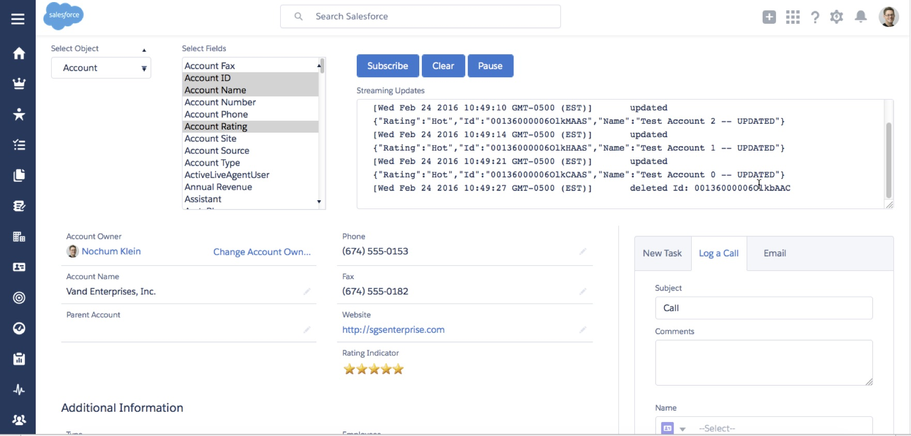

#Streaming Lightning Component

This repository contains a Lightning Component that displays streaming updates within a Salesforce Org.  It can be embedded in any Lightning Page (as of the current Spring '16 release only record home pages can be customized).  Upon initialization the component introspects the host org for any standard or custom objects that can be streamed, and displays them as a drop-down list.  When a user selects the object to be streamed, the component then introspects the org to determine the fields available on that object for streaming.  This is displayed as a second drop-down list, this one being a multi-select list.  The user can select the set of fields he or she wishes to see in streaming updates, and presses the "Subscribe" button.  This causes events related to records of the object type selected to be displayed in real-time.  These events include "Create", "Update", "Delete", and "Undelete" actions taken against records of the selected object.

This lightning component supports "Pause" capability, which updates received to be cached within the component and not displayed.  When event receipt is "Resumed", messages cached from the time of pause are displayed.

This lightning Component also supports the ability to "Clear" the box in which events are displayed.  This is helpful when messages receipt is "Paused".  If the box displaying events is "Cleared" before resuming, it becomes easy to catch up on messages that were cached.

##Implementation

This component is implemented as two separate components, a parent with a nested child.  The parent component handles user interactions.  It communicates with a server-side Apex controller, that handles object and field metadata introspection.  The child component handles all streaming functionality, and interacts with its own server-side Apex controller.  The parent component invokes methods of the child component, and receives component-level update events from the child.

This component attempts to shield the user from some of the complexities of creating and updating push topics.  Push topic names are not exposed to the user.  Instead, this component creates a user-specific push topic based on the user's unique Id within the Salesforce org.  This creates a user-specific push topic name.

##Dependencies

This component has the following dependencies:
* Salesforce Lightning Design System (SLDS) stylesheets
* Javascript libraries required for streaming
  * cometd.js
  * jquery151.js
  * json2.js
  * jquery_cometd.js
  
